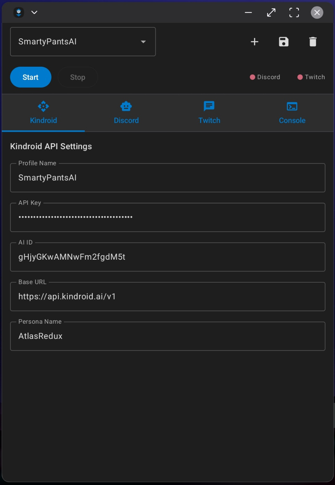
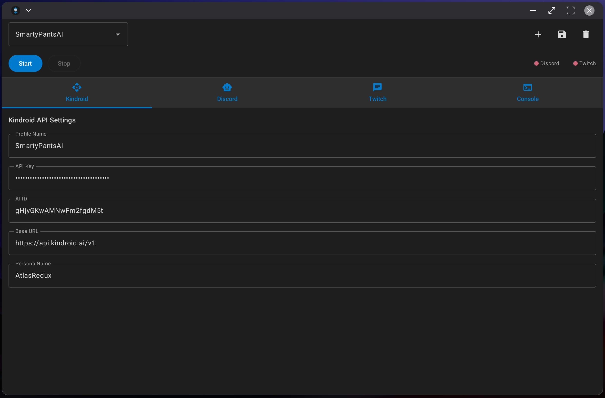

# Kindroid Bot (KBot)

An Android app that bridges your [Kindroid](https://kindroid.ai) AI companion to **Discord** and **Twitch** chat. Run it on your phone, tablet, or Android TV — your Kin replies to mentions in real time, even when the app is in the background.

> Ported from the original Windows desktop build (C++ / Win32) to Kotlin + Jetpack Compose.

## WARNING WARNING WARNING WARNING WARNING

While I have implemented an aggressive "smart" filter, it is not AI context aware and is very much breakable.
Always only expose your Kins to people you trust will not try to break guidelines, or you risk your account getting banned.

---

## Features

- **Kindroid AI relay** — sends chat messages to the Kindroid `/send-message` API and returns the AI's response
- **Discord bot** — connects via Gateway v10 WebSocket; responds when @mentioned in any channel
- **Twitch bot** — connects via IRC-over-WebSocket; responds when @mentioned in chat
- **Announcements** — automatic timed messages to Discord and/or Twitch with configurable interval, plus a Send Now button for immediate dispatch
- **Foreground service** — keeps connections alive in the background with wake/wifi locks
- **Profile system** — save, switch, and manage multiple bot configurations (different Kins, tokens, channels)
- **Live console** — scrolling log viewer with colour-coded tags + a direct message input for testing your Kin
- **Content filter** — inbound moderation filter blocks slurs, hate speech, CSAM, violence/self-harm planning, doxing, and illegal requests before they reach the Kindroid API. Includes evasion detection for leet-speak, unicode homoglyphs, inserted separators, and spaced-out letters. Slur database sourced from [dsojevic/profanity-list](https://github.com/dsojevic/profanity-list) (MIT)
- **Adaptive layout** — works on phones, tablets, and Samsung DeX / Android desktop mode


## Screenshots

<table align="center"><tr>
  <td></td>
  <td width="1" bgcolor="#444"></td>
  <td></td>
</tr></table>


## Requirements

| Requirement | Details |
|---|---|
| Android | 8.0+ (API 26) |
| Kindroid | API key + AI ID from [kindroid.ai](https://kindroid.ai) |
| Discord | Bot token from the [Discord Developer Portal](https://discord.com/developers/applications) |
| Twitch *(optional)* | Username + OAuth token from [twitchapps.com/tmi](https://twitchapps.com/tmi/) |

---


## Setup

1. **Install the APK** on your device (see [Building](#building) below, or grab a release APK from: https://github.com/AtlasRedux/KindroidAPIManager/releases/tag/V1.0)
2. Open the app and create a new profile
3. Fill in the **Kindroid** tab:
   - `API Key` — your Kindroid API key
   - `AI ID` — the ID of the Kin you want to use
   - `Base URL` — leave as `https://api.kindroid.ai/v1` unless you're self-hosting
   - `Persona Name` — the display name used in message context (e.g. "User")
4. Fill in the **Discord** tab:
   - `Bot Token` — from the Discord Developer Portal
   - Enable the toggle
5. *(Optional)* Fill in the **Twitch** tab:
   - `Username`, `OAuth Token`, `Channel`
   - Enable the toggle
6. *(Optional)* Fill in the **Announce** tab:
   - `Announcement Message` — the text to broadcast
   - `Discord Channel ID` — specific channel (leave blank to use the last active channel)
   - `Hours` / `Minutes` — how often to send
   - Toggle Discord and/or Twitch on
   - Use **Send Now** to dispatch immediately
7. Hit **Save**, then **Start**
8. Mention your bot in Discord or Twitch — it replies with the Kindroid AI response, @mentioning the user who triggered it

---

## Building

### Android Studio
1. Clone the repo
2. Open the project in Android Studio (Ladybug or newer recommended)
3. Sync Gradle, then **Run > app**

### Command Line
```bash
# Set JAVA_HOME to Android Studio's bundled JDK (adjust path for your install)
export JAVA_HOME="/path/to/AndroidStudio/jbr"

# Build debug APK
./gradlew assembleDebug

# Output: app/build/outputs/apk/debug/app-debug.apk
```

> **Note:** The project targets **SDK 35** and uses **Kotlin 2.1 + Compose BOM 2024.12.01**. Gradle 8.11.1 is specified in the wrapper.

---

## Architecture

```
com.nytte.kindroidbotmanager/
├── KindroidBotApp.kt              Application class
├── MainActivity.kt                Single-activity Compose host
├── data/
│   ├── model/BotProfile.kt       Serializable profile data class
│   └── repository/ProfileRepository.kt   JSON file persistence
├── network/
│   ├── KindroidApiClient.kt      OkHttp POST to Kindroid API
│   ├── DiscordGateway.kt         WebSocket gateway + REST replies
│   └── TwitchIrcClient.kt        IRC-over-WebSocket client
├── service/
│   └── BotForegroundService.kt   Foreground service with wake/wifi locks + announcement timer
├── ui/
│   ├── theme/Theme.kt            Dark Material 3 theme
│   ├── screens/                   Kindroid · Discord · Twitch · Announce · Console
│   ├── components/                ProfileSelector · BotControlBar
│   └── viewmodel/MainViewModel.kt
└── util/
    ├── ContentFilter.kt          Inbound message moderation filter
    └── LogEntry.kt               Timestamped, tagged log entries
```

**Key design decisions:**
- **OkHttp WebSocket** for both Discord Gateway and Twitch IRC — no extra dependencies needed
- **Foreground service** with `dataSync` type so Android doesn't kill the WebSocket connections
- **Single ViewModel** owns all state; the service exposes a `SharedFlow<LogEntry>` for the console
- **Coroutine-based announcement timer** — repeating `delay()` loop in the service scope, cancelled on stop
- Profiles are stored as a JSON array in the app's private files directory

---

## Dependencies

| Library | Purpose |
|---|---|
| Jetpack Compose (Material 3) | UI framework |
| OkHttp 4.12 | HTTP client + WebSocket |
| Kotlinx Serialization | JSON parsing |
| Kotlinx Coroutines | Async networking |
| AndroidX Lifecycle | ViewModel + state |

---

## Roadmap

- [ ] Import/export profile configurations
- [ ] Support for additional LLM APIs beyond Kindroid
- [ ] Customisable response formatting per platform
- [ ] Per-channel enable/disable for Discord

---

## License

This project is licensed under the [GNU General Public License v3.0](LICENSE).

---

## Contributing

Issues and pull requests are welcome. If you're adding a new chat platform, follow the pattern in `DiscordGateway.kt` / `TwitchIrcClient.kt` — implement a client class with `start()` / `stop()` and wire it into `BotForegroundService`.
